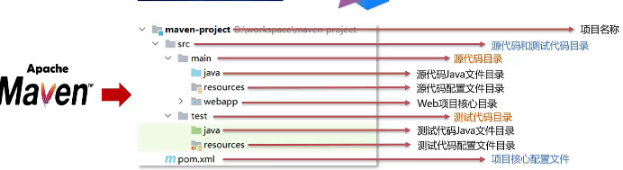
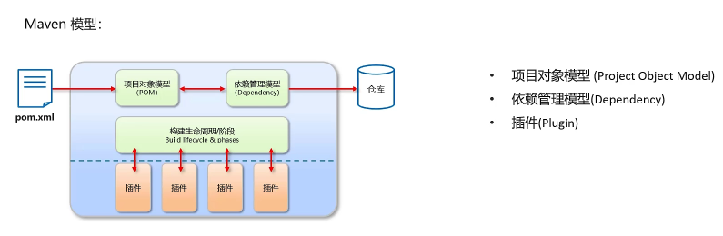
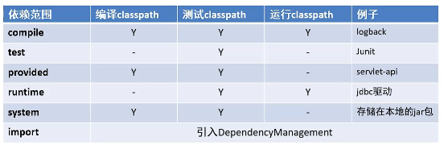

# Maven
+ Maven是专门用来管理和构建Java项目的工具，它的主要功能有：
  + 提供了一套标准化的项目结构
  + 提供了一套标准化的构建流程（编译、测试、打包、发布……）
  + 提供了一套依赖管理机制
  > Maven提供了一套标准化项目结构，所有IDE使用Maven构建的项目结构完全一样，所有IDE创建的Maven项目可以通用
  
  
+ 依赖管理
  + 依赖管理就是管理你项目所依赖的第三方资源（jar包、插件……）
# Maven 简介
  + Apache Maven 是一个项目管理和构建工具，它基于项目对象模型（POM）概念，通过一小段描述信息来管理项目的构建、报告和文档

  + 官网：http://maven.apache.org/

    
  
  + 仓库的分类：
    + 本地仓库：在自己计算机上的一个目录
    + 中央仓库：由Maven团队维护的全球唯一的仓库
      + 地址：https://repo1.maven.org/maven2/
    + 远程仓库（私服）：一般由公司团队搭建的私有仓库
  + 当项目中使用坐标引入对应依赖jar包后，首先会查找本地仓库中是否有对应的jar包：
    + 如果有，则在项目直接引用
    + 如果没有，则去中央仓库中下载对应的jar包到本地仓库
  + 还可以搭建远程仓库，将来jar包的查找顺序则变为：
    + 本地仓库 >> 远程仓库 >> 中央仓库
# Maven 安装配置
  1. 解压 apache-maven-3.6.1.rar
  2. 配置环境变量 MAVEN_HOME 为安装路径的bin目录
  3. 配置本地仓库：修改conf/setting.xml中的<localRepository>为一个指定目录
  4. 配置阿里云私服：修改conf/setting.xml中的<mirrors>标签，为其添加子标签
# Maven 基本使用
  + Maven 常用命令
    + compile:编译
    + clean:清理
    + test:测试
    + package:打包
    + install:安装
  + Maven 生命周期
    + Maven 构建项目生命周期描述的是一次构建过程经历经历了多少个事件
    + Maven 对项目构建的生命周期划分为3套
      + clean: 清理工作
      + default: 核心工作，例如编译，测试，打包，安装等
      + site:产生报告，发布站点
    > 同一生命周期内，执行后边的命令，前边的所有命令会自动执行
    + pre-clean >>> clean >>> post-clean
    + compile >>> test >>> package >>> install
    + pre-site >>> site >>> post-site
# IDEA 配置Maven
  1. IDEA配置Maven环境
  2. Maven坐标详解
     1. 什么是坐标？
        + Maven中坐标是**资源的唯一标识**
        + 使用坐标来定义项目或引入项目中需要的依赖
     2. Maven坐标主要组成
        + groupId:定义当前Maven项目隶属组织名称（通常是域名反写，例如：com.itHM）
        + artifactId:定义当前Maven项目名称（通常是模块名称，例如 order-service,goods-service）
        + version:定义当前项目版本号
  3. IDEA 创建Maven项目 
  4. IDEA 导入Maven项目
# 依赖管理
  **使用坐标导入jar包**
  1. 在 pom.xml中编写<dependencies> 标签
  2. 在<dependcies>标签中 使用<dependency>引入坐标
  3. 定义坐标的 groupId，artifactId，version
  4. 点击刷新按钮，使坐标生效

**依赖范围**
+ 通过设置坐标的依赖范围（scope），可以设置 对应jar包的作用范围：编译环境，测试环境，运行环境
<scope>test</scope>
+ 
+ <scope>默认值：compile
