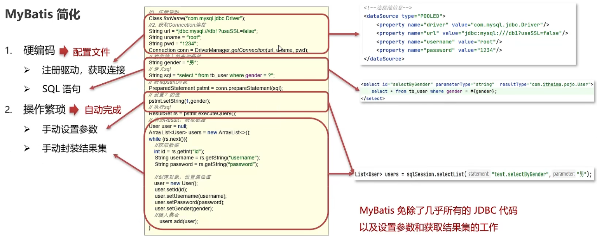

## 什么是MyBatis?
+ MyBatis是一款优秀的**持久层框架**，用于简化JDBC开发
+ 官网:https://mybatis.org/mybatis-3/zh/index.html
### 持久层
+ 负责将数据到保存到数据库的那一层代码
+ JavaEE三层架构：表现层、业务层、持久层
### 框架
+ 框架就是一个半成品软件，是一套可重用的，通用的，软件基础代码模型
+ 在框架的基础上构建软件编写更加高效，规范，通用，可扩展
### JDBC的缺点
1. 硬编码
   + 注册驱动，获取连接
   + SQL语句
2. 操作繁琐
   + 手动设置参数
   + 手动封装结果集

### MyBatis简化

