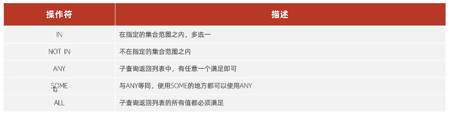

# MYSQL 基础

## SQL

### DDL 数据定义语言

### DML 数据操作语言

### DQL  数据查询语言

### DCL  数据控制语言

## 函数

指一段可以直接被另一端程序调用的程序或代码

 ### 字符串函数


### 数值函数


### 日期函数


### 流程函数

在SQL语句中实现条件筛选，从而提高语句的效率


## 约束

1. 概述：约束是作用于表中字段上的规则，用于限制存储在表中的数据。
2. 目的：保证数据库中数据的正确性，有效性和完整性。
3. 分类：


### 演示案例


```sql
CREATE TABLE USER (
	id INT PRIMARY KEY auto_increment COMMENT '主键',
	NAME VARCHAR ( 10 ) NOT NULL UNIQUE COMMENT '姓名',
	age INT CHECK ( age > 0 AND age <= 120 ) COMMENT '年龄',
	STATUS CHAR ( 1 ) DEFAULT '1' COMMENT '状态',
	gender CHAR ( 1 ) COMMENT '性别' 
) COMMENT '用户表';

```

### 外键约束

1. 概念：外键用来让两张表的数据之间建立连接，从而保证数据的一致性和完整性。

2. 删除/更新行为

   

## 多表查询

### 多表关系

1. 一对多（多对一）

   + 案例：部门与员工的关系

   + 关系：一个部门对应多个员工，一个员工对应一个部门

   + ==实现==：在多的一方建立外键，指向一的一方的主键

2. 多对多

   + 案例：学生与课程的关系
   + 关系：一个学生可以选修多个课程，一门课程可以供多个学生选择
   + ==实现==：建立第三张中间表，中间表至少包含两个外键，分别关联两方主键

3. 一对一

   + 案例：用户与用户详情的关系
   + 关系：一对一关系，多用于单表拆分，将一张表的基础字段放在一张表中，其他详情字段放在另一张表中，以提升操作效率
   + ==实现==：在任意一方加入外键，关联另一方的主键，并且设置外键为唯一的（UNIQUE）

### 多表查询概述

+ 概述：指从多张表中查询数据
+ 笛卡尔积：两个集合A集合和B集合的所有组合情况。（在多表查询时，需要消除无效的笛卡尔积）

### 多表查询分类

#### 连接查询

+ 内连接：相当于查询A、B交集部分数据

  + 隐式内连接

    ```SQL
    SELECT 字段列表 FROM 表1,表2 WHERE 条件……;
    ```

  + 显示内连接

    ```SQl
    SELECT 字段列表 FROM 表1 [INNER] JOIN 表2 ON 连接条件……;
    ```

  内连接查询的是两张表交集的部分

+ 外连接：

  + 左外连接：查询左表所有数据，以及两张表交集部分数据

    ~~~sql
    SELECT 字段列表 FROM 表1 LEFT [OUTER]JOIN 表2 ON 条件……;
    ~~~

    **相当于查询表1（左表）的所有数据 包含 表1和表2交集部分的数据**

  + 右外连接：查询右表所有数据，以及两张表交集部分数据

    ```SQL
    SELECT 字段列表 FROM 表1 RIGHT [OUTER]JOIN 表2 ON 条件……;
    ```

    **相当于查询表2（右表）的所有数据 包含 表1和表2交集部分的数据**

+ 自连接：当前表与自身的连接查询，自连接必须使用表别名 

  ```sql
  SELECT 字段列表 FROM 表A 别名A JOIN 表A 别名B ON 条件……;
  ```

  **自连接查询，可以是内连接查询，也可以是外连接查询。**

#### 联合查询

```SQL
SELECT 字段列表 FROM 表A……
UNION [ALL]
SELECT 字段列表 FROM 表B……;
```

**对于联合查询的多张表的列数必须保持一致，字段类型也需要保持一致**

**union all 会将全部的数据直接合并在一起，union 会对合并之后的数据去重**

#### 子查询

+ 概念：SQL语句中嵌套SELECT语句，称为==嵌套查询==，又称==子查询==。

```SQL
SELECT * FROM t1 WHERE column1 =(SELECT column1 FROM t2);
```

**子查询外部的语句可以是INSERT/UPATE/DELETE/SELECT的任何一个**

+ 根据子查询结果不同，分为：
  + 标量子查询（子查询结果为单个值）
  + 列子查询（子查询结果为一列）
    + 子查询返回的结果是一列（可以是多行），这种子查询称为列子查询。
    + 常用的操作符：IN、NOT IN、ANY、SOME、ALL
    + 
  + 行子查询（子查询结果为一行）
    + 行子查询返回的结果是一行（可以是多列），这种子查询称为行子查询。
    + 常用的操作符：=、<>、IN、NOT IN
  + 表子查询（子查询结果为多行多列）
    + 子查询返回的结果是多行多列，这种子查询称为表子查询。
    + 常用的操作符：IN
+ 根据子查询位置，分为：
  + WHERE之后、FROM之后、SELECT之后。

### 多表查询案例


## 事务

### 事务简介

**事务**：是一组操作的集合，它是一个不可分割的工作单位，事务会把所有操作作为一个整体一起向系统提交或撤销操作请求，即这些操作==要么同时成功，要么同时失败==。


默认MySQL的事务是自动提交的，也就是说，当执行一条DML语句，MySQL会立即隐式的提交事务。

### 事务操作

+ 查看/设置事务提交方式

  ```SQL
  SELECT @@autocommit;
  SET @@autocommit=0;
  ```

+ 开启事务

  ```sql
  START TRANSACTION 或 BEGIN
  ```

+ 提交事务

  ```SQL
  COMMIT;
  ```

+ 回滚事务

  ```SQL
  ROLLBACK;
  ```

### 事务四大特性（ACID）

+ 原子性（Atomicity）：事务是不可分割的最小操作单元，要么全部成功，要么全部失败。
+ 一致性（Consistency）:事务完成时，必须使所有的数据都保持一致状态。
+ 隔离性（Isolation）:数据库系统提供的隔离机制，保证事务在不受外部并发操作影响的独立环境下运行。
+ 持久性（Durability）:事务一旦提交或回滚，它对数据库中数据的改变就是永久的。

### 并发事务问题


### 事务隔离级别


**查看事务隔离级别**

```SQL
SELECT @@TRANSACTION_ISDLATION;
```

**设置事务隔离级别**

```SQL
SET [SESSION|GLOBAL] TRANSACTION ISOLATION LEVEL {READ UNCOMMITTED | READ COMMITTED | REPEATABLE READ | SERIALIZABLE}
```


