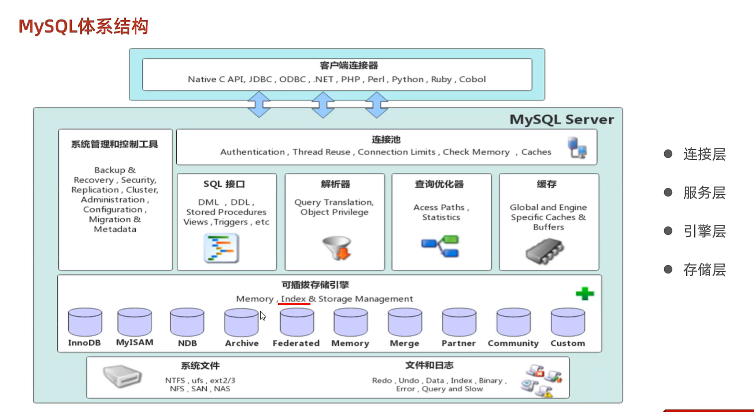
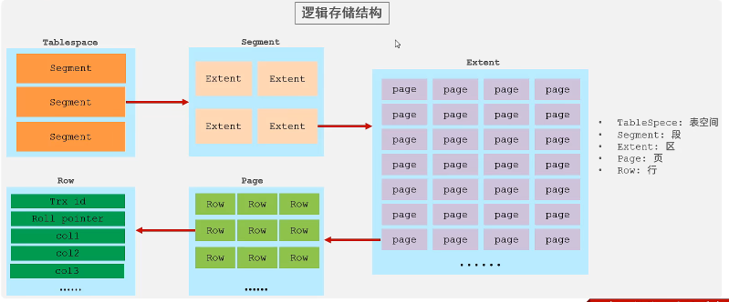
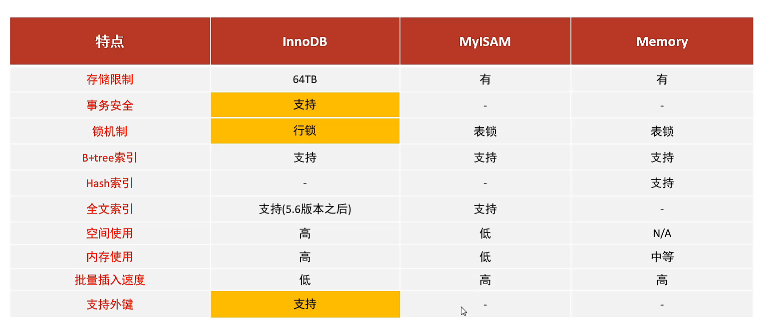

## MySQL 体系结构



## 存储引擎简介

存储引擎就是存储数据、建立索引、更新/查找数据等技术实现的方式。存储引擎是基于表的，而不是基于库的，所以存储引擎也可以被称为表类型。

1. 在创建表时，指定存储引擎

   ```SQL
   CREATE TABLE 表名(
   		字段1 字段1类型[COMMENT 字段1注释]
   		……
   		字段n 字段n类型[COMMENT 字段n注释]
   )ENGINE = INNODB [COMMENT 标注释];
   ```

2. 查看当前数据库支持的存储引擎

   ```SQL
   SHOW ENGINES;
   ```

## 存储引擎特点

+ InnoDB

  + 介绍

    + InnoDB是一种兼顾高可靠性和高性能的通用存储引擎，在MySQL 5.5之后，InnoDB是默认的MySQL存储引擎。

  + 特点

    + DML操作遵循ACID模型，支持事务；
    + 行级锁，提高并发访问性能；
    + 支持外键 FOREIGN KEY约束，保证数据的完整性和正确性；

  + 文件

    + xxx.ibd：xxx代表的是表名，innoDB引擎的每张表都会对应一个表空间文件，存储该表的表结构（frm,sdi）、数据和索引。
    + 参数：innodb_file_per_table

    

+ MyISAM

  + 介绍

    MyISAM是MySQL早期的默认存储引擎

  + 特点

    不支持事务、不支持外键

    支持表锁、不支持行锁

    访问速度块

+ Memory

  + 介绍

    Memory引擎的表数据时存储在内存中的，由于受到硬件问题、或断电问题的影响、只能将这些表作为临时表或缓存使用。

  + 特点

    内存存放

    hash索引（默认）

  + 文件

    xxx.sdi：存储表结构信息



## 存储引擎选择

在选择存储引擎时，应该根据应用系统的特点选择合适的存储引擎。对于复杂的应用系统，还可以根据实际情况选择多种存储引擎进行组合。

+ InnoDB:是Mysql的默认存储引擎，支持事务、外键。如果应用对事务的完整性有比较高的要求，在并发条件下要求数据的一致性，数据操作除了插入和查询之外，还包含很多的更新，删除操作，那么InnoDB存储引擎是比较合适的选择。
+ MyISAM:如果应用是以读操作和插入操作为主，只有很少的更新和删除操作，并且对事务的完整性、并发性要求不是很高，那么选择这个存储引擎是非常合适的。
+ MEMORY:将所有数据保存在内存中，访问速度快，通常临时表及缓存。MEMORY的缺陷就是对表的大小有限制，太大的表无法缓存在内存中，而且无法保障数据的安全性。

## 总结

### 1.体系结构

> 连接层、服务层、引擎层、存储层

### 2.存储引擎简介

```SQL
SHOW ENGINES;
CREATE TABLE XXXX(……)ENGINE =INNODB;
```

### 3.存储引擎特点

> INNODB 与 MyISAM:事务、外键、行级锁

### 4.存储引擎应用

> INNODB：存储业务系统中对于事务、数据完整性要求较高的核心数据。

>MyISAM：存储业务系统的非核心事务。


