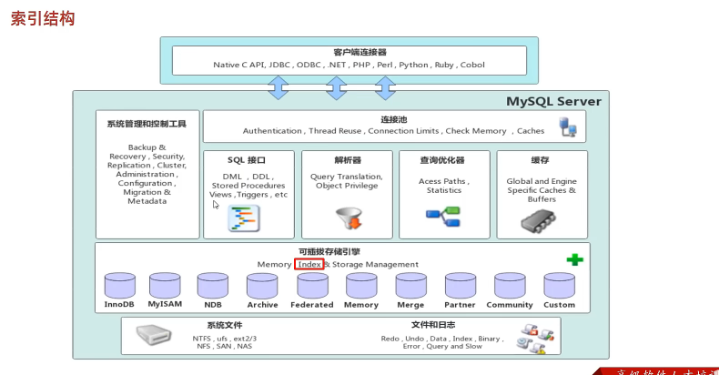
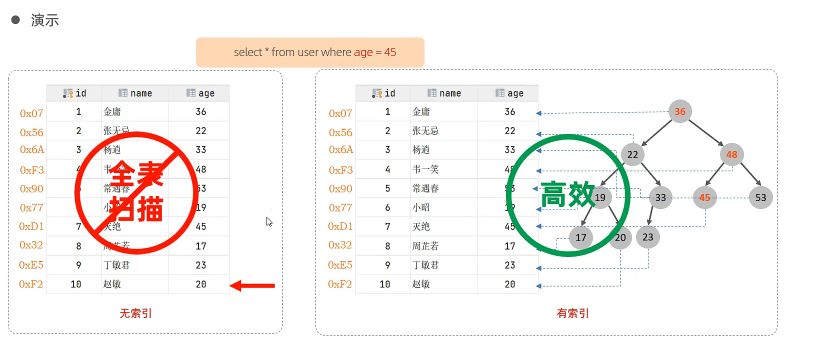
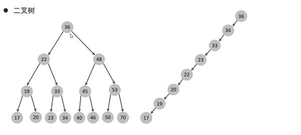
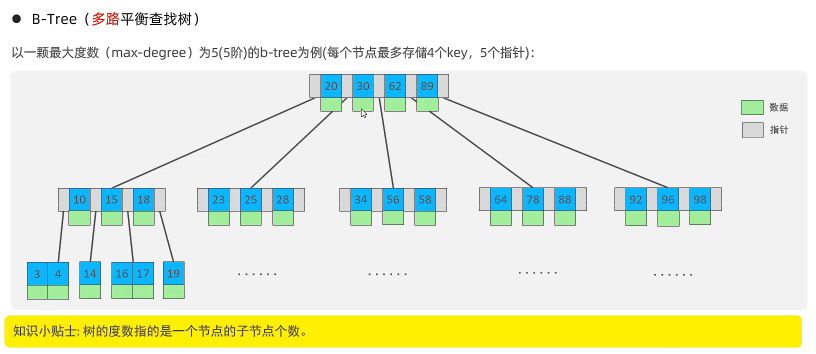
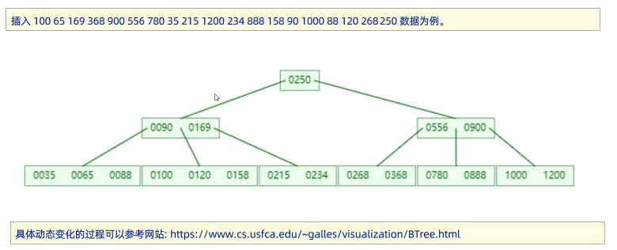
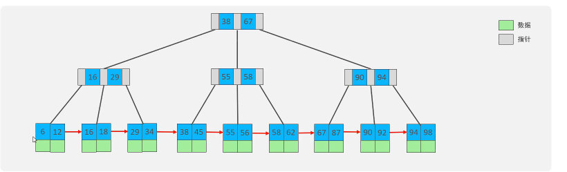
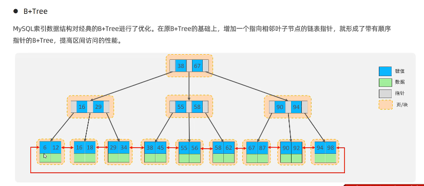

根据存储引擎的不同索引结构也不同

# 索引概述

+ 介绍：索引是帮助MySQL==高效获取数据==的==数据结构（有序）==。在数据外，数据库系统还维护着满足特定查找算法的数据结构，这些数据结构以某种方式引用（指向数据），这样就可以在这些数据结构上实现高级查找算法，这种数据结构就是索引。

  

+ 优缺点：

  | 优势                                                        | 劣势                                                         |
  | ----------------------------------------------------------- | ------------------------------------------------------------ |
  | 提高数据检索的效率，降低数据库的IO成本                      | 索引列也是要占用空间的。                                     |
  | 通过索引列对数据进行排序，降低数据排序的成本，降低CPU的消耗 | 索引大大提高了查询效率，同时却也降低更新表的速度，如对表进行INSERT、UODATE、DELETE时，效率降低 |

# 索引结构

MySQL的索引是在存储引擎层实现的，不同的存储引擎有不同的结构，主要包含以下几种：

| 索引结构            | 描述                                                         |
| ------------------- | ------------------------------------------------------------ |
| B+Tree              | 最常见的索引类型，大部分引擎都支持B+树索引                   |
| Hash索引            | 底层数据结构是用哈希表实现的，只有精确匹配索引列的查询才有效，不支持范围查询 |
| R-tree(索引)        | 空间索引是MyISAM引擎的一个特殊索引类型，主要用于地理空间数据类型，通常使用较少 |
| Full-text(全文索引) | 是一种通过建立倒排索引，快速匹配文档的方式。类似于Lucene,Solr,ES |

| 索引       | InnoDB          | MyISAM | Memory |
| ---------- | --------------- | ------ | ------ |
| B+Tree索引 | 支持            | 支持   | 支持   |
| Hash索引   | 不支持          | 不支持 | 支持   |
| R-tree索引 | 不支持          | 支持   | 不支持 |
| Full-text  | 5.6版本之后支持 | 支持   | 不支持 |

我们平常所说的索引，如果没有特别指明，都是B+树结构组织的索引

+ 二叉树缺点：顺序插入时，会形成一个链表，查询性能大大降低。大数据量情况下，==层级较深==，检索速度慢。
+ 红黑树：大数据量情况下，层级较深，检索速度慢。

+ B-Tree(多路平衡查找树）

+ B+Tree

以一颗最大度数（max-degree）为4（4阶）的b+tree为例：

 相对于B-Tree区别：

1. 所有的数据都会出现在叶子节点
2. 叶子节点形成一个单向链表

+ Hash

哈希索引就是采用一定的hash算法，将键值换算成新的hash值，映射到对应的槽位上

如果两个（或多个）键值，映射到一个相同的槽位上，他们就产生了hash冲突（也称为hash碰撞），可以通过链表来解决。

+ Hash索引特点
  1. Hash索引只能用于对等比较（=，in），不支持范围查询（between,>,<,……）
  2. 无法利用索引完成排序操作
  3. 查询效率高，通常只需要一次检索就可以了，效率通常要高于B+Tree索引
+ 存储引擎支持
  + 在MySQL中，支持hash索引的是Memory引擎，而InnoDB中具有自适应hash功能，hash索引是存储引擎根据B+Tree索引在指定条件下自动构建的。

## 为什么InnoDB存储引擎选择使用B+Tree索引结构？

+ 相较于二叉树，层级更少，搜索效率高；
+ 对于B-Tree，无论是叶子节点还是非叶子节点，都会保存数据，这样导致一页存储的键值减少，指针跟着减少，要保存大量数据，只能增加树的高度，导致性能降低
+ 相对Hash索引，B+Tree支持范围匹配及排序操作

# 索引分类

| 分类     | 含义                                                 | 特点                     | 关键字   |
| -------- | ---------------------------------------------------- | ------------------------ | -------- |
| 主键索引 | 针对表中主键创建的索引                               | 默认自动创建，只能有一个 | PRIMARY  |
| 唯一索引 | 避免同一个表中某数据列中的值重复                     | 可以有多个               | UNIQUE   |
| 常规索引 | 快速定位特定数据                                     | 可以有多个               |          |
| 全文索引 | 全文索引查找的是文本中的关键字，而不是比较索引中的值 | 可以有多个               | FULLTEXT |

# 索引语法

# SQL性能分析

# 索引使用

# 索引设计原则

